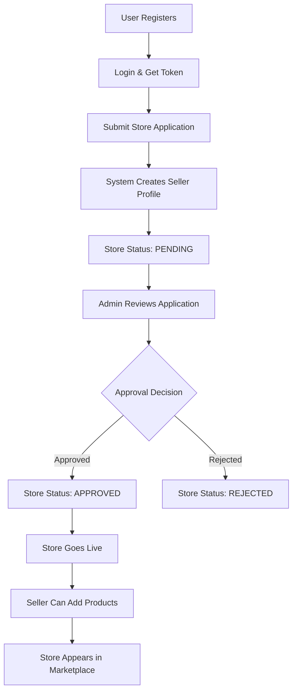
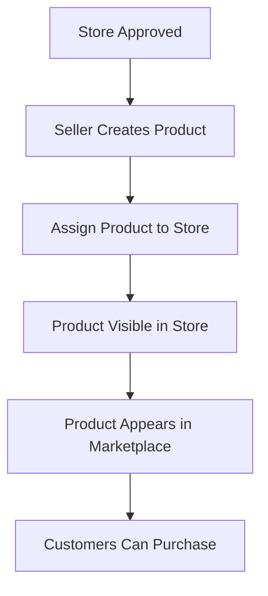

# Store Enrollment Guide - Multi-Store Marketplace

## Overview

The Amazon Clone now supports multiple stores and seller marketplaces! This comprehensive guide explains how to enroll stores, manage them, and understand the complete workflow from enrollment to going live.

## 🏪 Multi-Store Marketplace Features

### For Customers:
- **Browse Multiple Stores**: Discover stores by category, location, rating
- **Store Profiles**: View detailed store information, hours, contact details
- **Store Reviews**: Rate and review stores based on experience
- **Product Attribution**: See which store each product belongs to
- **Store-Specific Shopping**: Filter products by specific stores

### For Sellers:
- **Multiple Store Management**: Manage multiple store locations
- **Store Analytics**: Track performance, orders, revenue by store
- **Store Customization**: Customize store profile, hours, contact info
- **Product Assignment**: Assign products to specific stores
- **Review Management**: Monitor and respond to store reviews

### For Admins:
- **Store Approval System**: Review and approve new store applications
- **Store Monitoring**: Monitor store performance and compliance
- **Analytics Dashboard**: Overall marketplace analytics across all stores

## 🚀 Store Enrollment Process

### Step 1: User Account Required
Before enrolling a store, you need:
- A registered user account
- Logged-in authentication token

### Step 2: Store Enrollment API

**Endpoint**: `POST /api/v1/stores/enroll`

**Headers**:
```
Authorization: Bearer {your_jwt_token}
Content-Type: application/json
```

**Required Fields**:
```json
{
  "name": "Your Store Name",
  "category": "Electronics", // Electronics, Fashion, Home & Garden, etc.
  "address": "123 Store Street",
  "city": "New York",
  "state": "NY",
  "zipCode": "10001"
}
```

**Optional Fields**:
```json
{
  "description": "Store description and unique value proposition",
  "country": "United States", // defaults to "United States"
  "phone": "+1-555-123-4567",
  "email": "store@example.com",
  "website": "https://yourstore.com",
  "openingHours": "{\"monday\": \"9:00 AM - 8:00 PM\", \"tuesday\": \"9:00 AM - 8:00 PM\"}",
  "establishedYear": 2020,
  "licenseNumber": "STORE-2020-001",
  "taxId": "EIN-12-3456789",
  "socialMedia": "{\"facebook\": \"https://facebook.com/yourstore\"}"
}
```

### Step 3: Application Review
1. **Automatic Seller Profile**: If you don't have a seller profile, one is created automatically
2. **Status**: Store starts with `PENDING` status
3. **Admin Review**: Admins review applications via `/api/v1/stores/admin/pending`
4. **Approval Process**: Admins can approve, reject, or suspend stores

### Step 4: Store Approval
Once approved:
- Store status changes to `APPROVED`
- Store becomes `isActive: true`
- Store appears in public marketplace listings
- You can start adding products to the store

## 📋 Store Categories

**Available Categories:**
- Electronics
- Fashion & Apparel
- Home & Garden
- Sports & Fitness
- Books & Media
- Health & Beauty
- Toys & Games
- Automotive
- Food & Grocery
- Business & Industrial

## 🛠️ Store Management APIs

### Get Your Stores
```http
GET /api/v1/stores/seller/my-stores
Authorization: Bearer {token}
```

### Update Store Information
```http
PUT /api/v1/stores/{store_id}
Authorization: Bearer {token}
Content-Type: application/json

{
  "description": "Updated store description",
  "phone": "+1-555-NEW-PHONE",
  "openingHours": "{\"monday\": \"8:00 AM - 9:00 PM\"}"
}
```

### Store Analytics
```http
GET /api/v1/stores/{store_id}/analytics?period=30d
Authorization: Bearer {token}
```

## 🔍 Public Store Discovery

### Browse All Stores
```http
GET /api/v1/stores?category=Electronics&city=San Francisco&rating=4.0
```

**Query Parameters:**
- `page`: Page number (default: 1)
- `limit`: Items per page (default: 20, max: 50)
- `category`: Filter by store category
- `city`: Filter by city
- `search`: Search in name, description, category
- `rating`: Minimum rating (0-5)
- `isPremium`: Filter premium stores only
- `sortBy`: name, rating, createdAt, totalReviews
- `sortOrder`: asc, desc

### Get Store Details
```http
GET /api/v1/stores/{store_id}
```

Returns:
- Complete store information
- Store products (first 12)
- Recent store reviews (first 5)
- Store statistics

## 📊 Store Reviews System

### Submit Store Review
```http
POST /api/v1/stores/{store_id}/reviews
Authorization: Bearer {token}
Content-Type: application/json

{
  "rating": 5,
  "title": "Excellent store!",
  "content": "Great service and product quality. Highly recommended!",
  "images": ["https://example.com/review-image1.jpg"]
}
```

**Requirements:**
- User must be authenticated
- One review per user per store
- Rating: 1-5 stars
- Title: 1-200 characters
- Content: 10-1000 characters

## 👨‍💼 Admin Store Management

### View Pending Store Applications
```http
GET /api/v1/stores/admin/pending
Authorization: Bearer {admin_token}
```

### Approve/Reject Store
```http
PATCH /api/v1/stores/admin/{store_id}/status
Authorization: Bearer {admin_token}
Content-Type: application/json

{
  "status": "APPROVED", // APPROVED, REJECTED, SUSPENDED
  "reason": "Store meets all requirements"
}
```

## 🏬 Store Statuses

| Status | Description | Public Visible | Can Add Products |
|--------|-------------|----------------|------------------|
| `PENDING` | Under review | ❌ | ❌ |
| `APPROVED` | Approved and active | ✅ | ✅ |
| `REJECTED` | Application rejected | ❌ | ❌ |
| `SUSPENDED` | Temporarily suspended | ❌ | ❌ |

## 🎯 Store Types

### Regular Stores
- Basic marketplace presence
- Standard listing features
- Normal search visibility

### Premium Stores
- Enhanced visibility in search
- Featured placement opportunities
- Priority customer support
- Advanced analytics
- Custom branding options

## 💡 Best Practices for Store Enrollment

### 1. Complete Your Profile
- Provide detailed store description
- Add professional photos (logo, cover image)
- Include all contact information
- Set accurate business hours

### 2. Business Documentation
- Valid business license number
- Tax identification number
- Established year and credentials
- Professional email address

### 3. Store Category Selection
- Choose the most relevant primary category
- Ensure your products match the category
- Consider customer search behavior

### 4. Location Accuracy
- Provide complete, accurate address
- Include proper ZIP/postal codes
- Verify city and state information

### 5. Contact Information
- Professional business phone number
- Dedicated store email address
- Active website (if available)
- Social media profiles

## 🔄 Workflow Examples

### Store Enrollment Workflow



### Product-Store Assignment



## 📱 Frontend Integration Examples

### Store Enrollment Form

```javascript
const enrollStore = async (storeData) => {
  const response = await fetch('/api/v1/stores/enroll', {
    method: 'POST',
    headers: {
      'Authorization': `Bearer ${authToken}`,
      'Content-Type': 'application/json'
    },
    body: JSON.stringify(storeData)
  });

  if (response.ok) {
    const result = await response.json();
    console.log('Store enrolled:', result.data.store);
    // Show success message: "Application submitted for review"
  }
};
```

### Store Discovery

```javascript
const discoverStores = async (filters = {}) => {
  const params = new URLSearchParams(filters);
  const response = await fetch(`/api/v1/stores?${params}`);
  const data = await response.json();

  return data.data.stores;
};

// Usage
const electronicStores = await discoverStores({
  category: 'Electronics',
  city: 'San Francisco',
  rating: 4.0,
  sortBy: 'rating',
  sortOrder: 'desc'
});
```

## 🎯 Success Metrics

### For Stores:
- **Application Approval Rate**: Target >90%
- **Time to Approval**: Target <48 hours
- **Store Rating**: Maintain >4.0 stars
- **Product Catalog**: Add 10+ products within first month

### For Marketplace:
- **Store Diversity**: Multiple categories represented
- **Geographic Coverage**: Stores across different cities
- **Quality Standards**: High-rated stores (>4.0 average)
- **Active Stores**: Regular product updates and engagement

## 🔧 Technical Requirements

### Database Schema
- Store information and metadata
- Store-product relationships
- Store reviews and ratings
- Store analytics and performance data

### API Endpoints
- Store CRUD operations
- Store discovery and filtering
- Review management
- Analytics and reporting

### Security
- JWT authentication for all store operations
- Role-based access (customer, seller, admin)
- Input validation and sanitization
- Rate limiting on store creation

This comprehensive store system transforms the platform into a true multi-vendor marketplace, enabling multiple sellers to operate their own branded stores while maintaining centralized management and customer experience.
